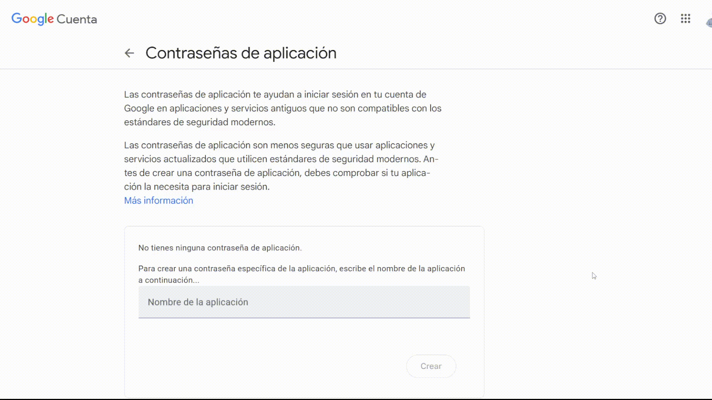
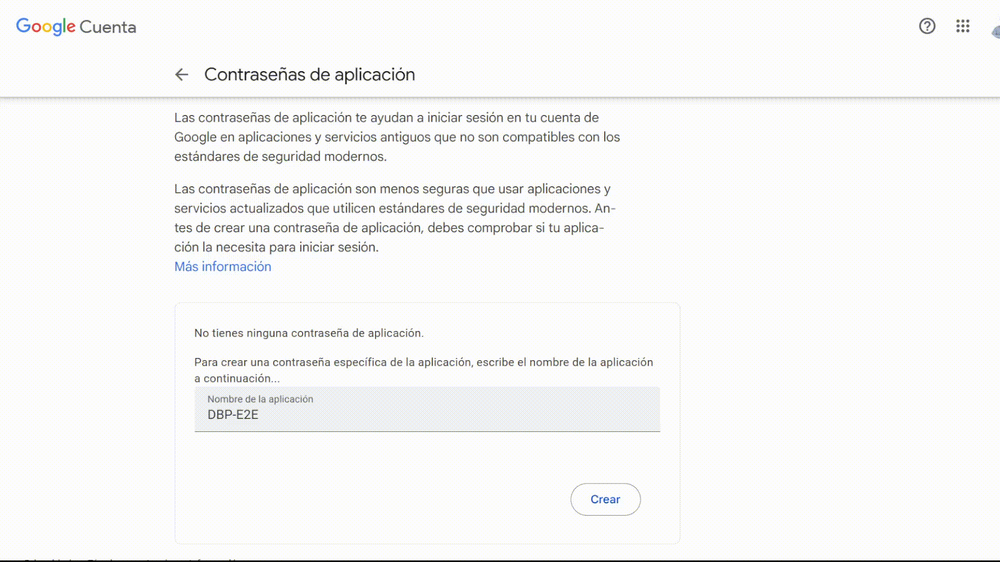

# 📋 Proyecto E2E - Entrega 3

## Descripción 💡

En esta entrega, trabajarás con pruebas unitarias y de integración utilizando herramientas como Testcontainers y
Mockito. Además, implementaremos eventos asíncronos para enviar correos electrónicos de confirmación cuando se cree un
nuevo viaje.

## Evaluación 🚀

Esta tarea se evaluará manualmente. Asegúrate de seguir todas las instrucciones y completar cada tarea indicada para
obtener la calificación máxima. El detalle de los puntos asignados se encuentra en las secciones correspondientes a cada
prueba. No se otorgarán puntos adicionales por agregar pruebas o funcionalidades adicionales.

## Pruebas con Testcontainers 🧪 (5 Puntos)

Usaremos Testcontainers para probar la base de datos. En esta entrega, nos centraremos en `RideRepository`, la clase
responsable de las operaciones CRUD.

### Funciones a probar con Testcontainers

1. **createRide(Ride ride)** (1 Punto):
   Verifica si se puede crear un viaje.
2. **findById(Long id)** (1 Punto):
   Comprueba si se puede encontrar un viaje por su ID.
3. **deleteById(Long id)** (1 Punto):
   Prueba la eliminación de un viaje por ID.
4. **findAllByArrivalDateAndDestinationCoordinates(LocalDateTime arrivalDate, Coordinate destinationCoordinates)** (1
   Punto):
   Verifica la búsqueda por fecha de llegada y coordenadas de destino.
5. **findAllByPassengerIdAndStatus(Long passengerId, Status status, Pageable pageable)** (1 Punto):
   Evalúa la búsqueda de viajes por pasajero y estado.

### 🚫 Enfoque antiguo: herencia de clase abstracta

```java

@DataJpaTest
@Testcontainers
public abstract class AbstractContainerBaseTest {
    private static final PostgreSQLContainer<?> postgresqlContainer;

    static {
        postgresqlContainer = new PostgreSQLContainer<>("postgres:latest")
                .withDatabaseName("e2eTestDb")
                .withUsername("e2e")
                .withPassword("e2e");
        postgresqlContainer.start();
    }

    @DynamicPropertySource
    static void overrideTestProperties(DynamicPropertyRegistry registry) {
        registry.add("spring.datasource.url", postgresqlContainer::getJdbcUrl);
        registry.add("spring.datasource.username", postgresqlContainer::getUsername);
        registry.add("spring.datasource.password", postgresqlContainer::getPassword);
    }
}
```

#### 🟡 Problemas:

- Fuerte **acoplamiento por herencia**.
- Dificultad para combinar configuraciones múltiples.
- ❌ **Spring Boot 3.1+ desaconseja** este enfoque en favor de la **composición**.

### ✅ Enfoque moderno: configuración y composición

Spring Boot 3.1+ permite usar `@ServiceConnection` para integrar Testcontainers automáticamente.

#### 📦 Crea una clase de configuración en `src/test/java/org.e2e.labe2e03/config`

```java

@TestConfiguration(proxyBeanMethods = false)
public class PostgresTestContainerConfig {
    @Bean
    @ServiceConnection
    PostgreSQLContainer<?> postgresContainer() {
        return new PostgreSQLContainer<>(DockerImageName.parse("postgres:latest"));
    }
}
```

#### 🧪 Luego úsala en tus clases de prueba

```java

@DataJpaTest
@Testcontainers
@Import(PostgresTestContainerConfig.class)
@AutoConfigureTestDatabase(replace = AutoConfigureTestDatabase.Replace.NONE)
class RideRepositoryTest {
    @Autowired
    private RideRepository rideRepository;

    // Tests aquí...
}
```

### ⚠️ ¿Por qué se necesita `@AutoConfigureTestDatabase(replace = Replace.NONE)`?

Por defecto, `@DataJpaTest` intenta **reemplazar tu base de datos real con una en memoria (H2)** para facilitar pruebas
rápidas.

#### ⛔ Problema:

Si no incluyes esta anotación, **Spring ignorará tu contenedor de PostgreSQL** y usará H2 (u otra in-memory DB), lo que
**invalidará tus pruebas reales de integración**.

#### ✅ Solución:

```java

@AutoConfigureTestDatabase(replace = AutoConfigureTestDatabase.Replace.NONE)
class RideRepositoryTest {
}
```

Esto le dice a Spring:

> “No reemplaces mi configuración de base de datos, yo me encargo (con Testcontainers)”.

### 🏁 Conclusión

| Enfoque                                            | Estado     | Recomendación                        |
|----------------------------------------------------|------------|--------------------------------------|
| Herencia de clase abstracta                        | ✅ Funciona | ⚠️ No recomendado                    |
| Configuración vía `@Import` y `@ServiceConnection` | ✅ Funciona | ✅ **Recomendado** (Spring Boot 3.1+) |

Usar `@Import(PostgresTestContainerConfig.class)` junto con `@AutoConfigureTestDatabase(replace = Replace.NONE)` es la *
*forma correcta y moderna** de configurar pruebas de persistencia con Testcontainers en Spring Boot.

### ¿Qué tengo que testear? 🤔

1. Verifica las operaciones CRUD de `RideRepository`:
   Confirma que las operaciones de creación, lectura, actualización y eliminación funcionan. 🌱📖✏️❌
2. Asegúrate de que las consultas personalizadas dan el resultado esperado.
   Por ejemplo, intenta eliminar o buscar viajes que no existen. 🔍❓
3. Comprueba las relaciones entre las entidades.
   Si un pasajero crea un viaje, ¿se guarda en la base de datos? Si un conductor lo acepta, ¿se actualiza el estado del
   viaje? 🚗💾
4. Si tienes dudas, revisa la implementación de `RideRepository` y piensa en posibles casos de prueba. Asegúrate de que
   la base de datos funcione como se espera. 🧠✅

#### Ayudita 🤓

Si en mi base de datos no he creado ningún viaje, ¿qué debería devolver la consulta `findAllByPassengerIdAndStatus`? 🤔

- **Respuesta A**: Devolver una lista vacía.
- **Respuesta B**: Devolver un error.
- **Respuesta C**: Devolver `null`.
- **Respuesta D**: Devolver todos los viajes.
- **Respuesta E**: Devolver solo los viajes del pasajero.

La respuesta correcta es la **A**. Si no hay viajes, la consulta debería devolver una lista vacía. 🌱📖✏️❌

Entonces, mi test debería verificar que la lista está vacía cuando no hay viajes para un pasajero. 🔍❓

### Posibles problemas con Testcontainers 🛠️

- **El contenedor no inicia**:
  Verifica si Docker está instalado y en ejecución. Si no, instálalo y reinicia tu computadora. 💻🔄
- **Problemas de rendimiento**:
  Si experimentas lentitud, intenta aumentar la memoria asignada a Docker. Cierra otras aplicaciones para mejorar el
  rendimiento. 🚀✨

## Pruebas con Mockito 🤖 (5 puntos)

Probaremos el controlador `RideController`, responsable de las solicitudes HTTP relacionadas con viajes. Mockito es una
biblioteca de Java para crear objetos simulados y realizar pruebas unitarias. Se usó en el demo de la clase de
auditorio.

### ¿Cómo implementaremos las pruebas?

1. **Objetos Simulados**: Usaremos objetos simulados para probar el controlador sin conectarse a una base de datos.
2. **Comportamiento del Controlador**: Verificaremos que los métodos del controlador se llamen correctamente y devuelvan
   resultados esperados.
3. **Pruebas Unitarias**: Evaluaremos los métodos del controlador para confirmar que funcionan correctamente.

#### Ejemplo con MathController 🤓

En la clase de Auditorio, usamos Mockito para probar el controlador `MathController`. Probaremos los endpoints de
división:

```java

@GetMapping("/div/{a}/{b}")
public ResponseEntity<Integer> getDivision(@PathVariable Integer a, @PathVariable Integer b) {
    if (b == 0) return ResponseEntity.badRequest().build();
    return ResponseEntity.ok(a / b);
}
```

Para esta prueba, queremos validar si el controlador devuelve el resultado correcto. El siguiente test muestra cómo usar
Mockito para este caso:

```java

@SpringBootTest
@AutoConfigureMockMvc
public class Demo1ApplicationTests {
    @Autowired
    private MockMvc mockMvc;

    @Test
    public void shouldReturnQuotient_WhenDividingTwoPositiveIntegers() throws Exception {
        mockMvc.perform(get("/div/10/2"))
                .andExpect(status().isOk())
                .andExpect(jsonPath("$").value(5));
    }

    @Test
    public void shouldReturnBadRequest_WhenDividingByZero() throws Exception {
        mockMvc.perform(get("/div/10/0"))
                .andExpect(status().isBadRequest());
    }
}
```

El primer test verifica que dividir 10 entre 2 dé 5. El segundo test comprueba si dividir entre 0 devuelve error 400. En
ambos casos, usamos `MockMvc` para simular solicitudes HTTP y verificar las respuestas. 🤖🔍

Como puedes ver, Mockito es útil para pruebas sin depender de bases de datos. También se puede usar para verificar si
los métodos se llaman con parámetros específicos y devuelven resultados esperados. Para más detalles sobre Mockito,
consulta [la documentación oficial](https://javadoc.io/doc/org.mockito/mockito-core/latest/org/mockito/Mockito.html)
y [este tutorial](https://medium.com/javarevisited/restful-api-testing-in-java-with-mockito-controller-layer-f4605f8ffaf3)
📚🔍.

### Métodos a probar con Mockito

1. **passengerBookRide(Ride ride)** (1 punto): Valida la creación de un viaje por un pasajero.
2. **cancelRide(Long rideId)** (1 punto): Comprueba la cancelación de un viaje.
3. **getRideByUser(Long userId, int page, int size)** (1 punto): Verifica la obtención de viajes por usuario.
4. **driverAssignRide(Long rideId)** (2 puntos): Evalúa la asignación de un viaje a un conductor.

## Convención de Nomenclatura para Pruebas 📋

Sigue el patrón **"Given-When-Then"** expresado en la nomenclatura de métodos:

```
shouldReturn[ExpectedResult]_When[Condition]()
```

**¿Por qué es importante este patrón?**

- **Claridad**: Cualquier desarrollador puede entender inmediatamente qué hace la prueba sin leer el código.
- **Mantenibilidad**: Facilita encontrar y modificar pruebas específicas cuando cambia la funcionalidad.
- **Documentación viva**: Los nombres de las pruebas actúan como documentación del comportamiento esperado.

**Ejemplos:**

- `shouldReturnBadRequest_WhenOriginAndDestinationAreTheSame()`
- `shouldReturnOk_WhenValidRideData()`
- `shouldReturnNotFound_WhenRideDoesNotExist()`

**Esta convención será calificada**: las pruebas que no la sigan recibirán penalización en la evaluación.

## Implementando Envío de Correos ✉️ (10 Puntos)

¡Imagina esto!: Quieres enviar correos electrónicos de confirmación cuando un viaje es creado. Pero no quieres que la
aplicación se ralentice por eso. Así que decides usar eventos asíncronos para mantener todo funcionando sin problemas.
¿Cómo lo logras? Vamos a verlo. 📧🚀

Usaremos un método para enviar correos de forma rápida y eficiente. Los eventos asíncronos nos ayudarán a lograrlo sin
afectar el rendimiento. ¿Listo para configurar el correo electrónico y enviar confirmaciones sin estrés? 💪

### Funcionalidades a Implementar

1. **Configuración del Correo Electrónico** (1 Punto):
   Configura Gmail para enviar correos mediante SMTP.
2. **Creación del Servicio de Correos** (2 Puntos):
   Crea un `EmailService` para enviar correos electrónicos.
3. **Envío de Correos desde el Controlador** (1 Punto):
   Implementa un endpoint para enviar correos de prueba.
4. **Confirmación de Ride con Eventos Asíncronos** (4 Puntos):
   Envía un correo de confirmación cuando se cree un nuevo viaje.
5. **HTML en Correos** (2 Puntos):
   Agrega HTML a los correos para hacerlos más atractivos.

#### Configuración del Correo Electrónico 💻

Primero, vamos a configurar Gmail para enviar correos mediante SMTP. Así podrás enviar correos electrónicos
automáticamente sin depender de un servidor físico. Para ello, sigue estos pasos:

1. **Abre tu cuenta de Gmail**.
2. **Dirígete a Contraseñas de Aplicaciones o App Passwords**.
   [Aquí tienes el enlace](https://myaccount.google.com/apppasswords).
3. **Introduce tu contraseña de Gmail si te la pide**.
4. **Crea una nueva aplicación con el nombre de tu proyecto**.
   
5. **Copia la contraseña generada para usarla luego**. ¡Es como tu clave mágica para enviar correos! 🪄
   

Después, vamos a configurar `Spring Mail` con esta contraseña para permitir que tu aplicación envíe correos electrónicos
de manera segura y sin problemas. En el archivo `application.properties`, añade las siguientes propiedades:

```properties
spring.mail.host=smtp.gmail.com
spring.mail.port=587
spring.mail.username=${MAIL_SMPT_USERNAME}
spring.mail.password=${MAIL_SMPT_PASSWORD}
spring.mail.properties.mail.smtp.auth=true
spring.mail.properties.mail.smtp.starttls.enable=true
```

Recuerda almacenar tus credenciales sensibles como `${MAIL_SMPT_USERNAME}` y `${MAIL_SMPT_PASSWORD}` en un archivo
.env. ⚠️ Este archivo no debe estar bajo control de versiones (añádelo al .gitignore). Así proteges tus datos y
mantienes buenas prácticas de seguridad. ¿Listo para probar el envío de correos? Vamos a crear el servicio de correos.
📬

#### Creando el Servicio de Correos 💌

Para enviar correos electrónicos, necesitamos un `EmailService`. Aquí tienes un ejemplo que puedes usar:

```java

@Service
@RequiredArgsConstructor
public class EmailService {
    private final JavaMailSender mailSender;

    public void sendSimpleMessage(String to, String subject, String text) {
        SimpleMailMessage message = new SimpleMailMessage();
        message.setTo(to);
        message.setSubject(subject);
        message.setText(text);
        mailSender.send(message);
    }
}
```

Ahora vamos a crear un endpoint de prueba en el controlador `RideController` para enviar correos electrónicos:

```java

@PostMapping("/hola")
public ResponseEntity<String> sendEmail(@RequestParam String email) {
    emailService.sendSimpleMessage(email, "Correo de Prueba", "Este es un correo de prueba");
    return ResponseEntity.ok("¡Hola mundo!");
}
```

Ahora puedes hacer un post a `/hola` con un parámetro `email` para enviar un correo de prueba. Ten en cuenta que el
parámetro es una query param y no un cuerpo JSON. 📧🚀

#### Lentitud en el Envío de Correos 🐢

Si has hecho esto, es posible que hayas notado que el proceso se siente un poco lento. Esto sucede porque el envío de
correos electrónicos implica varios pasos: conectarse al servidor SMTP, autenticarse, componer el mensaje y finalmente
enviarlo. Todos estos pasos requieren tiempo, lo que puede hacer que tu aplicación se ralentice mientras espera la
confirmación de envío. 🐢

En lugar de enviar correos directamente en el controlador (lo que puede bloquear la ejecución), una solución más
eficiente es usar asincronía con eventos. La asincronía permite que tu aplicación continúe ejecutándose mientras otras
operaciones, como el envío de correos electrónicos, se realizan en segundo plano. Esto evita que tus usuarios
experimenten demoras o bloqueos mientras esperan que el correo sea enviado. 🕒

Aquí es donde los eventos entran en juego. ¿Por qué usar eventos y no solo asincronía directa? Los eventos te permiten
desacoplar la lógica de envío de correos del flujo principal de la aplicación. Esto significa que puedes desencadenar el
envío de correos desde cualquier parte del código sin afectar el rendimiento general de la aplicación.

Los eventos ofrecen ventajas adicionales:

- **Desacoplamiento**:
  Al usar eventos, puedes separar la lógica de negocio de la lógica de envío de correos. Si en el futuro necesitas
  cambiar la forma de enviar correos o agregar más funcionalidades, puedes hacerlo sin afectar otras partes de tu
  aplicación.
- **Escalabilidad**:
  Si tu aplicación crece y necesitas manejar más correos, los eventos te permiten escalar sin problemas, ya que el
  procesamiento se realiza en segundo plano.
- **Flexibilidad**:
  Con eventos, puedes tener múltiples listeners para el mismo evento, lo que te permite ejecutar diferentes acciones
  según el evento recibido. Esto puede ser útil para notificaciones, registros o cualquier otra operación relacionada.

#### Usando Eventos Asíncronos para Correos 📡

Los eventos asíncronos permiten que la aplicación continúe funcionando mientras el correo electrónico se envía en
segundo plano. Además, esto ayuda a desacoplar la lógica del envío de correos de otras operaciones. Los eventos tienen
tres partes:

1. **Evento**: La clase que representa el evento a ser publicado.
2. **Publicador**: La clase que publica el evento.
3. **Listener**: La clase que escucha el evento y ejecuta la lógica asociada.

#### Creando el Evento de Envío de Correos 📩

Para enviar correos asíncronamente, crearemos un evento para indicar cuándo enviar un correo. Aquí tienes un ejemplo:

```java

@Getter
public class HelloEmailEvent extends ApplicationEvent {
    private final String email;

    public HelloEmailEvent(String email) {
        super(email);
        this.email = email;
    }
}
```

#### Publicando el Evento desde el Controlador 📣

El publicador es el que lanza el evento. En este caso, el publicador será el `RideController` que manda el evento para
el envío de correos:

```java

@RestController
@RequestMapping("/ride")
@RequiredArgsConstructor
public class RideController {
    private final ApplicationEventPublisher applicationEventPublisher;

    @PostMapping("/hola")
    public ResponseEntity<String> sendEmail(@RequestParam String email) {
        applicationEventPublisher.publishEvent(new HelloEmailEvent(email));
        return ResponseEntity.ok("¡Hola mundo!");
    }
}
```

#### Creando el Listener para Enviar Correos 🚀

El listener es el que recibe el evento y realiza la acción correspondiente. Aquí, enviará un correo cuando reciba el
evento:

```java

@Component
@RequiredArgsConstructor
public class EmailListener {
    private final EmailService emailService;

    @EventListener
    @Async
    public void handleHelloEmailEvent(HelloEmailEvent event) {
        emailService.sendSimpleMessage(event.getEmail(), "Correo de Prueba", "Este es un correo de prueba");
    }
}
```

#### Advertencia: usa la capa de servicio 🚨

En aplicaciones bien estructuradas, los eventos deben desencadenarse a nivel de servicio, no desde el controlador. El
controlador debería llamar al servicio correspondiente, y este sería el encargado de lanzar el evento. En este ejemplo,
el controlador lanza el evento para simplificar la explicación, pero en una implementación real, este patrón no es
adecuado.

🚨 Para mantener una arquitectura clara, el evento debería originarse desde la capa de servicio. Puedes crear una carpeta
llamada "Event" dentro de esta capa para gestionar y organizar todos los eventos que tu aplicación necesite. 📁 Esto
proporciona una mejor separación de responsabilidades y hace que el código sea más fácil de mantener y probar.

Si en tu implementación, el controlador lanza el evento, no se dará puntaje completo en esta tarea. Asegúrate de seguir
las mejores prácticas de arquitectura y diseño de software. 🏗️📦

### Enviar Correos con HTML 🌐

¿Quieres que tus correos tengan un toque especial? Con HTML, puedes crear correos atractivos con imágenes, enlaces y
mucho estilo. Así tus mensajes serán mucho más interesantes. Aquí tienes algunos pasos para lograrlo:

1. **Investiga Spring Boot y HTML**: Averigua cómo enviar correos con HTML en Spring Boot. Los correos pueden ser
   personalizados y lucir mucho mejor que los correos de texto plano. 📧✨

2. **Usa Thymeleaf para Plantillas**: Thymeleaf es una herramienta que te permite crear plantillas HTML para tus
   correos. Puedes rellenarlas con datos dinámicos y reutilizarlas. ¡Es genial para personalizar correos! 🌟📧

3. **Haz Pruebas con Thymeleaf**: Crea una plantilla HTML simple y prueba enviarla como correo electrónico. Así podrás
   ver cómo se verá para tus destinatarios. 💌

4. **Agrega Imágenes y Estilos CSS**: Una vez que tengas la plantilla, intenta añadir imágenes, estilos CSS y otros
   elementos para que tus correos se vean más atractivos y profesionales. 🎨🌐

Si quieres más detalles, sigue estas guías sobre cómo enviar correos con HTML en Spring Boot usando Thymeleaf:

- [Thymeleaf para correos con HTML](https://www.thymeleaf.org/doc/articles/springmail.html)
- [Envío de correos con Spring Boot y Thymeleaf](https://nuwanthafernando95.medium.com/spring-boot-email-template-with-thymeleaf-4f21ca437b52)

¡Listo! Ahora puedes crear correos más atractivos y llamativos usando HTML y Thymeleaf. ¿Qué te parece? ¿Listo para
enviar correos con estilo? 📧🌟

## Notas adicionales ✍️

- Implementa las pruebas unitarias y de integración en la carpeta `src/test/java/org.e2e.labe2e03/`.
- Recuerda incluir el envío de correos electrónicos al crear un nuevo viaje.
- No borres carpetas de configuración necesarias para correr el proyecto, como `.run`. De lo contrario, se
  descontarán **dos puntos** si al clonar el proyecto es necesario realizar configuraciones adicionales para poder
  ejecutarlo.
- Dado que la calificación será manual y considerando el nivel de expertise esperado en aspectos básicos como la
  correcta gestión de variables de entorno, se descontarán **3 puntos por exponer variables de entorno** (por
  ejemplo: puerto, nombre de la base de datos, Google App Key, etc.).
